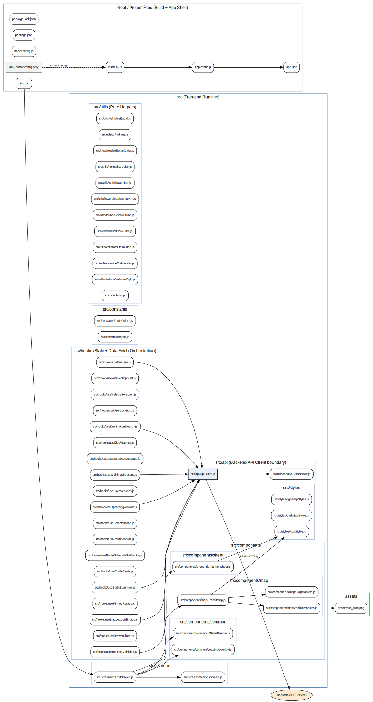

# ReachHFX — Real-Time Transit ETA Platform (Overview)

## What ReachHFX Does

ReachHFX provides real-time transit ETAs by ingesting **GTFS-Realtime (protobuf)** updates, merging them with **static GTFS schedules**, and serving low-latency queries to a React Native client.

**Scope:** 80 routes • 2,317 stops • Halifax

---

## Architecture

### Backend

### Frontend

---

## High-Level Components

- **React Native Mobile Client**
  - Stop search + arrivals/ETAs
  - Calls backend endpoints for stop/route ETA data

- **Backend API (Node.js)**
  - Serves ETA queries from an in-memory transit state model
  - Exposes endpoints for stop search and arrival predictions

- **Ingestion + State Updater**
  - Pulls GTFS-RT protobuf feed on ~5s cadence
  - Merges real-time updates with static GTFS schedules
  - Maintains current “transit state” in memory for low-latency reads

- **Deployment**
  - Runs on AWS Lightsail (Ubuntu)
  - Scheduled ingestion jobs + repeatable deployments

---

## Key Engineering Decisions

### Performance
- **Precomputed stop → trip mappings** to avoid repeated scans and recomputation
- In-memory indexing/state optimized for fast per-stop ETA queries

### Freshness
- Targeted **~5-second** update cadence driven by GTFS-RT ingestion

### Delivery & Quality
- GitHub Actions CI validates iOS builds for App Store/TestFlight compatibility

---

## Metrics

- **ETA lookup performance:** ~70% improvement via precomputed mappings
- **Update cadence:** 5 seconds
- **TestFlight:** 25+ active testers

---

## Contact

Riley Devitt — rileydevitt@dal.ca
